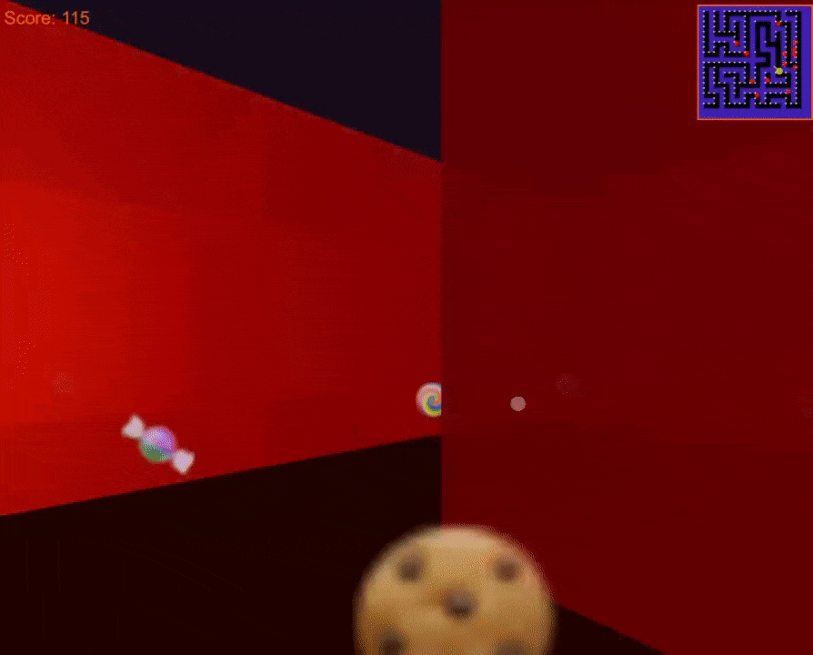

# 3D Spooky Maze Battle

A Halloween-themed 3D maze battle game built with Next.js, Three.js, and TypeScript.



## Features

- Procedurally generated 3D maze
- First-person shooter mechanics
- Enemy AI and pathfinding
- Mobile-friendly controls
- Responsive design
- Spooky Halloween theme
- Real-time score tracking
- Minimap navigation
- Immersive sound effects

## Getting Started

1. Clone the repository:
```bash
git clone https://github.com/harukaapps/3D-Battle-Maze.git
cd 3D-Battle-Maze
```

2. Install dependencies:
```bash
npm install
```

3. Start the development server:
```bash
npm run dev
```

4. Open [http://localhost:3000](http://localhost:3000) in your browser.

## How to Play

### Desktop Controls
- WASD - Movement
- Mouse drag - Camera rotation
- Space/Click - Shoot

### Mobile Controls
- Virtual joystick - Movement
- Touch & drag - Camera rotation
- Fire button - Shoot

## Built With

- [Next.js](https://nextjs.org/) - React framework
- [Three.js](https://threejs.org/) - 3D graphics library
- [TypeScript](https://www.typescriptlang.org/) - Type safety
- [Tailwind CSS](https://tailwindcss.com/) - Styling

## Compatibility

- Desktop browsers (Chrome, Firefox, Safari, Edge)
- Mobile devices (iOS, Android)
- Responsive design for all screen sizes

## Design

- Dark purple background (#1a0f1f)
- Halloween-themed UI elements
- Spooky atmosphere with fog effects
- Minimalist, modern interface

## Author

**haruka_apps**

- GitHub: [@harukaapps](https://github.com/harukaapps)

## License

This project is licensed under the MIT License - see the [LICENSE](LICENSE) file for details.
